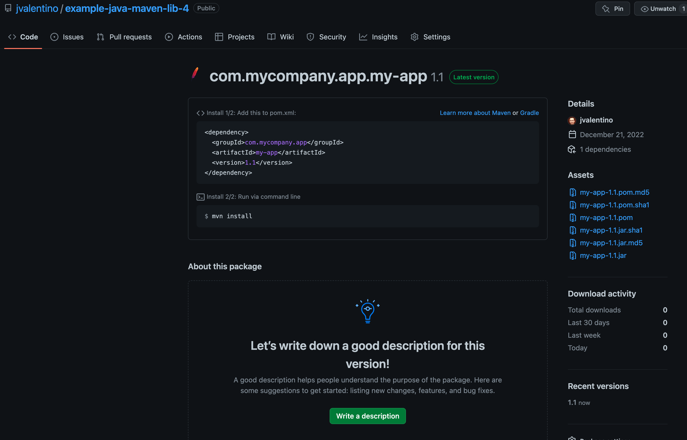

# Example Java Library using Maven: Part 4

This is the final step in the Java Library example, which demonstrates how to publish the Jar file to a Maven style repository hosted on Github.com as a package.

Prerequisites

- Git Setup: https://github.com/jvalentino/setup-git
- Building Java 101: https://github.com/jvalentino/java-building-101
- Maven-Java Part 1: https://github.com/jvalentino/example-java-maven-lib-1
- Maven-Java Part 2: https://github.com/jvalentino/example-java-maven-lib-2
- Maven-Java Part 3: https://github.com/jvalentino/example-java-maven-lib-3

# (1) What is a Maven Repository?

> A repository in Maven holds build artifacts and dependencies of varying types.
>
> There are exactly two types of repositories: **local** and **remote**:
>
> 1. the **local** repository is a directory on the computer where Maven runs. It caches remote downloads and contains temporary build artifacts that you have not yet released.
> 2. **remote** repositories refer to any other type of repository, accessed by a variety of protocols such as `file://` and `https://`. These repositories might be a truly remote repository set up by a third party to provide their artifacts for downloading (for example, [repo.maven.apache.org](https://repo.maven.apache.org/maven2/)). Other "remote" repositories may be internal repositories set up on a file or HTTP server within your company, used to share private artifacts between development teams and for releases.

- https://maven.apache.org/guides/introduction/introduction-to-repositories.html

# (2) Why Github.com Packages?

...because it is there, it is free, and I don't need someone to manually approve a project like on Maven Central.

The theory here works anywhere. You just need to add the appropriate repository type, credentials, and URL.

# (3) Version 

pom.xml

```xml
 <version>${revision}</version>
```


# (4) Distribution Management

pom.xml

```xml
  <distributionManagement>
    <repository>
      <id>github</id>
      <name>GitHub Packages</name>
      <url>https://maven.pkg.github.com/jvalentino/example-java-maven-lib-4</url>
    </repository>
  </distributionManagement>
```

# (5) ~/.m2/settings.xml

```xml
<settings>
    <servers>
        <server>
            <id>${repo.id}</id>
            <username>${repo.login}</username>
            <password>${repo.pwd}</password>
        </server>
    </servers>
</settings>  
```

# (6) Running it

```bash
$ ./mvnw \
    -Drepo.id=github \
    -Drepo.login=USERNAME \
    -Drepo.pwd=TOKEN \
    -Drevision=1.1 \
    clean deploy
    
[INFO] Scanning for projects...
[INFO] 
[INFO] ----------------------< com.mycompany.app:my-app >----------------------
[INFO] Building my-app 1.1
[INFO] --------------------------------[ jar ]---------------------------------
[INFO] 
[INFO] --- maven-clean-plugin:3.1.0:clean (default-clean) @ my-app ---
[INFO] Deleting /Users/john.valentino/workspaces/personal/example-java-maven-lib-4/target
[INFO] 
[INFO] --- jacoco-maven-plugin:0.8.8:prepare-agent (jacoco-prepare) @ my-app ---
[INFO] argLine set to -javaagent:/Users/john.valentino/.m2/repository/org/jacoco/org.jacoco.agent/0.8.8/org.jacoco.agent-0.8.8-runtime.jar=destfile=/Users/john.valentino/workspaces/personal/example-java-maven-lib-4/target/jacoco.exec
[INFO] 
[INFO] --- maven-resources-plugin:3.0.2:resources (default-resources) @ my-app ---
[INFO] Using 'UTF-8' encoding to copy filtered resources.
[INFO] skip non existing resourceDirectory /Users/john.valentino/workspaces/personal/example-java-maven-lib-4/src/main/resources
[INFO] 
[INFO] --- maven-compiler-plugin:3.8.0:compile (default-compile) @ my-app ---
[INFO] Changes detected - recompiling the module!
[INFO] Compiling 1 source file to /Users/john.valentino/workspaces/personal/example-java-maven-lib-4/target/classes
[INFO] 
[INFO] --- maven-resources-plugin:3.0.2:testResources (default-testResources) @ my-app ---
[INFO] Using 'UTF-8' encoding to copy filtered resources.
[INFO] skip non existing resourceDirectory /Users/john.valentino/workspaces/personal/example-java-maven-lib-4/src/test/resources
[INFO] 
[INFO] --- maven-compiler-plugin:3.8.0:testCompile (default-testCompile) @ my-app ---
[INFO] Changes detected - recompiling the module!
[INFO] Compiling 1 source file to /Users/john.valentino/workspaces/personal/example-java-maven-lib-4/target/test-classes
[INFO] 
[INFO] --- maven-surefire-plugin:2.22.1:test (default-test) @ my-app ---
[INFO] 
[INFO] -------------------------------------------------------
[INFO]  T E S T S
[INFO] -------------------------------------------------------
[INFO] Running com.mycompany.app.AppTest
[INFO] Tests run: 1, Failures: 0, Errors: 0, Skipped: 0, Time elapsed: 0.03 s - in com.mycompany.app.AppTest
[INFO] 
[INFO] Results:
[INFO] 
[INFO] Tests run: 1, Failures: 0, Errors: 0, Skipped: 0
[INFO] 
[INFO] 
[INFO] --- jacoco-maven-plugin:0.8.8:report (jacoco-report) @ my-app ---
[INFO] Loading execution data file /Users/john.valentino/workspaces/personal/example-java-maven-lib-4/target/jacoco.exec
[INFO] Analyzed bundle 'my-app' with 1 classes
[INFO] 
[INFO] --- maven-jar-plugin:3.0.2:jar (default-jar) @ my-app ---
[INFO] Building jar: /Users/john.valentino/workspaces/personal/example-java-maven-lib-4/target/my-app-1.1.jar
[INFO] 
[INFO] --- jacoco-maven-plugin:0.8.8:check (jacoco-check) @ my-app ---
[INFO] Loading execution data file /Users/john.valentino/workspaces/personal/example-java-maven-lib-4/target/jacoco.exec
[INFO] Analyzed bundle 'my-app' with 1 classes
[INFO] All coverage checks have been met.
[INFO] 
[INFO] >>> maven-pmd-plugin:3.19.0:check (default) > :pmd @ my-app >>>
[INFO] 
[INFO] --- maven-pmd-plugin:3.19.0:pmd (pmd) @ my-app ---
[WARNING] Unable to locate Source XRef to link to - DISABLED
[WARNING] Unable to locate Source XRef to link to - DISABLED
[INFO] PMD version: 6.49.0
[WARNING] Removed misconfigured rule: LoosePackageCoupling  cause: No packages or classes specified
[INFO] Rendering content with org.apache.maven.skins:maven-default-skin:jar:1.3 skin.
[INFO] 
[INFO] <<< maven-pmd-plugin:3.19.0:check (default) < :pmd @ my-app <<<
[INFO] 
[INFO] 
[INFO] --- maven-pmd-plugin:3.19.0:check (default) @ my-app ---
[INFO] PMD version: 6.49.0
[INFO] You have 11 PMD violations. For more details see: /Users/john.valentino/workspaces/personal/example-java-maven-lib-4/target/pmd.xml
[INFO] The build is not failed, since 11 violations are allowed (maxAllowedViolations).
[INFO] 
[INFO] >>> maven-pmd-plugin:3.19.0:cpd-check (default) > :cpd @ my-app >>>
[INFO] 
[INFO] --- maven-pmd-plugin:3.19.0:cpd (cpd) @ my-app ---
[WARNING] Unable to locate Source XRef to link to - DISABLED
[WARNING] Unable to locate Source XRef to link to - DISABLED
[INFO] PMD version: 6.49.0
[INFO] Rendering content with org.apache.maven.skins:maven-default-skin:jar:1.3 skin.
[INFO] 
[INFO] <<< maven-pmd-plugin:3.19.0:cpd-check (default) < :cpd @ my-app <<<
[INFO] 
[INFO] 
[INFO] --- maven-pmd-plugin:3.19.0:cpd-check (default) @ my-app ---
[INFO] PMD version: 6.49.0
[INFO] 
[INFO] 
[INFO] --- maven-install-plugin:2.5.2:install (default-install) @ my-app ---
[INFO] Installing /Users/john.valentino/workspaces/personal/example-java-maven-lib-4/target/my-app-1.1.jar to /Users/john.valentino/.m2/repository/com/mycompany/app/my-app/1.1/my-app-1.1.jar
[INFO] Installing /Users/john.valentino/workspaces/personal/example-java-maven-lib-4/pom.xml to /Users/john.valentino/.m2/repository/com/mycompany/app/my-app/1.1/my-app-1.1.pom
[INFO] 
[INFO] --- maven-deploy-plugin:2.8.2:deploy (default-deploy) @ my-app ---
Uploading to github: https://maven.pkg.github.com/jvalentino/example-java-maven-lib-4/com/mycompany/app/my-app/1.1/my-app-1.1.jar
Uploaded to github: https://maven.pkg.github.com/jvalentino/example-java-maven-lib-4/com/mycompany/app/my-app/1.1/my-app-1.1.jar (3.3 kB at 1.0 kB/s)
Uploading to github: https://maven.pkg.github.com/jvalentino/example-java-maven-lib-4/com/mycompany/app/my-app/1.1/my-app-1.1.pom
Uploaded to github: https://maven.pkg.github.com/jvalentino/example-java-maven-lib-4/com/mycompany/app/my-app/1.1/my-app-1.1.pom (5.2 kB at 2.1 kB/s)
Downloading from github: https://maven.pkg.github.com/jvalentino/example-java-maven-lib-4/com/mycompany/app/my-app/maven-metadata.xml
Downloaded from github: https://maven.pkg.github.com/jvalentino/example-java-maven-lib-4/com/mycompany/app/my-app/maven-metadata.xml (217 B at 588 B/s)
Uploading to github: https://maven.pkg.github.com/jvalentino/example-java-maven-lib-4/com/mycompany/app/my-app/maven-metadata.xml
Uploaded to github: https://maven.pkg.github.com/jvalentino/example-java-maven-lib-4/com/mycompany/app/my-app/maven-metadata.xml (324 B at 814 B/s)
[INFO] ------------------------------------------------------------------------
[INFO] BUILD SUCCESS
[INFO] ------------------------------------------------------------------------
[INFO] Total time:  20.291 s
[INFO] Finished at: 2022-12-21T16:03:36-06:00
[INFO] ------------------------------------------------------------------------
```

